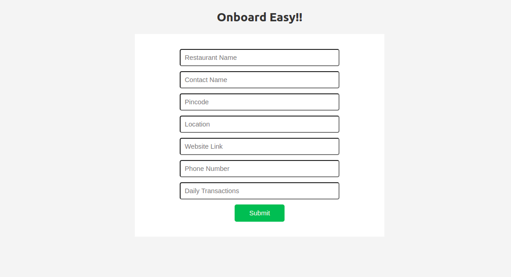
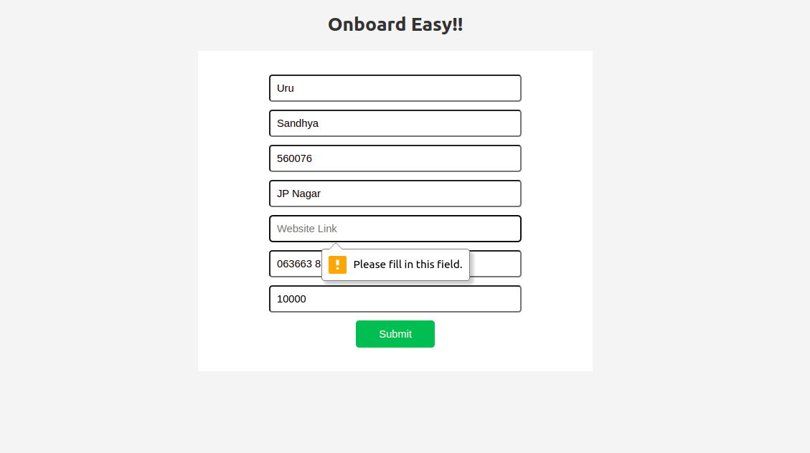
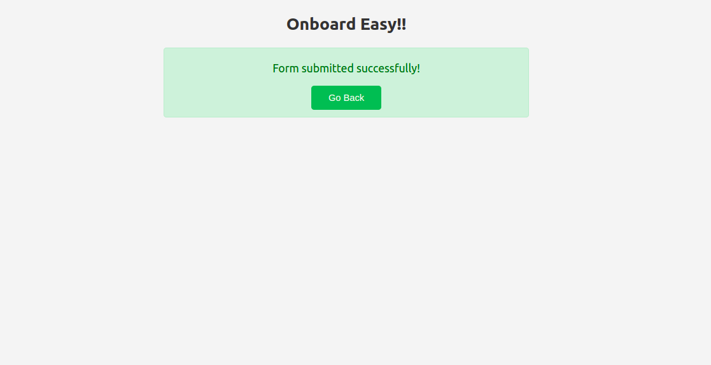
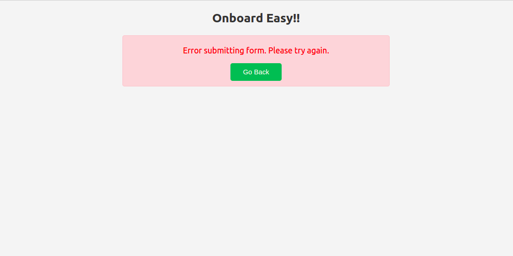

# OnboardEasy!!! 

Welcome to OnBoardEasy, a streamlined Onboarding for Restaurants in the Food Delivery Industry.
## Features

- User-friendly form for restaurant registration.
- Form validation to ensure all required fields are filled.
- Successful submission status display.
- Error handling for failed submissions.
## Technologies Used

- Frontend: ReactJs
- Backend: Node.js, Express.js, MongoDB
- Styling: CSS
## Folder Structure

The project follows a standard folder structure, with the following layout:
- `server.js`: The main entry point of the backend server.
- `package.json`: Configuration file that includes project dependencies and scripts.
- `node_modules/`: Directory containing the installed npm packages.
- `public/`: Directory containing publicly accessible files.
  - `index.html`: The main HTML file that serves as the entry point for the application.
- `src/`: Directory containing the source code of the application.
  - `components/`: Directory for React components.
    - `RestaurantForm.js`: Component for the restaurant form.
  - `models/`: Directory for database models or schemas.
    - `Restaurant.js`: Model for the restaurant data in the database.
  - `css/`: Directory for CSS files.
    - `RestaurantForm.css`: CSS file specific to the restaurant form 
       component.
    - `app.js`: The main entry point of the React application.
  - `app.css`: CSS file for the overall application styling.
  - `index.js`: Entry point for rendering the React application.
  - `index.css`: CSS file specific to the index page.
 - `.gitignore` : Tells git which files to ignore.
 - `.env`: Configuration file for environment variables.

## Getting Started

1. Clone the repository: 
`git clone <repository-url>`
2. Install dependencies: `npm install`
3. Start the backend server: `node server.js`
4. Start the frontend development server: `npm start`
5. Access the application in your browser at: `http://localhost:5433`

Make sure to have MongoDB installed and running on your machine before starting the server.

## Screenshots
1. This is how the form looks like on successffully running the project.

2. Form has a validation that does not allow the user to submit unless all the fields are filled.

3. On successful submission of the form, we can see the status as follows.

4. On failure, we can see the error message as follows.

## Contributing

Contributions are welcome! If you find any issues or have suggestions for improvements, please open an issue or submit a pull request.

## License

This project is licensed under the [MIT License](LICENSE)